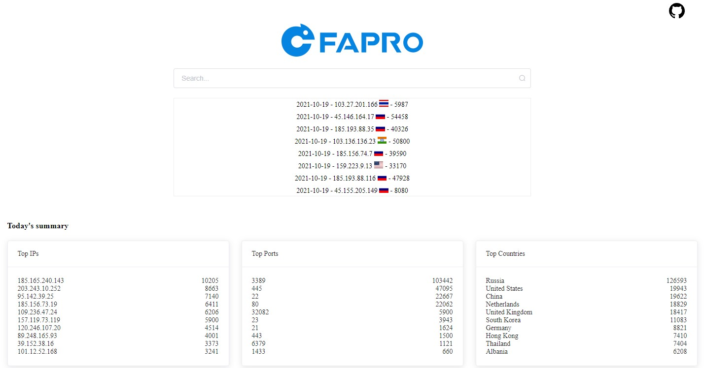
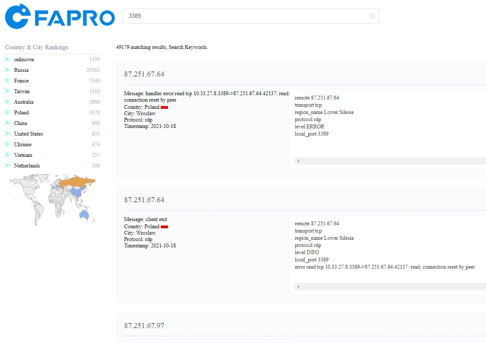

# How to build a network scanning analysis platform - Part I

## [中文版](howto_CN_1.md)

## Description

As the network becomes more and more developed, various kinds of traffic in the network are also increasing. Search engines, attack surface management engines, malicious scanning, network worms, etc will constantly scan internet servers to achieve their goals.

This series of tutorials introduces how to build an analysis platform for network scanning step by step to analyze and identify various scanning traffic.

Find which IP is scanning? What is the purpose of these scans?

The follows will show the current effect:





[Example website](https://faweb.fofa.so/)

Part1: **Build a distributed scan log collection system**

## Technical selection

Collecting scan logs should not be recognized by the scanner as a honeypot, providing a simple deployment method, easy to add log collection node, and quick start and stop. It is better to use fewer system resources, which can reduce the cost and maintenance cost of the log collection node.

Scan log collection nodes are best distributed in various countries so that the observation points will be more comprehensive.

We finally chose to use [FaPro](https://github.com/fofapro/fapro/)，**Free,Cross-platform,Single-file mass network protocol server simulator**，Can easily start or stop multiple network services. 

For more details, please [see the official introduction](https://github.com/fofapro/fapro)。

By deploying scan log collectors(FaPro) in multiple countries around the world, different services can be started for each log collection node, and the normal devices can be simulated to prevent being identified and discovered by the scanner.

FaPro uses relatively few resources, and a cloud server with a minimum configuration of 1H1G can meet the demand and save node costs.

Log storage use[Elasticsearch](https://www.elastic.co/guide/index.html)，convenient for log search and analysis.


Automation Platform use[ansible](https://docs.ansible.com/)，used for batch deployment and monitoring log collection nodes 

## Preparation
Several Linux servers, Used to place the scan log collector (FaPro), close all service ports on the existing server to prevent the collected log records from being disturbed.

Log storage server, use Elasticsearch for log storage and analysis, it is recommended to use 8G memory + 200G storage, or directly use the Elastic service of the cloud service provider.

Install Ansible locally for the batch deployment of scanning data collection nodes. The local environment in the tutorial uses the ubuntu system. If you use other systems, please refer to the Ansible documentation.

## Configuration settings

### Configure ansible

Set the host in .ssh/config and add configuration items for each server:
```shell
Host sensor01 # host name
  HostName x.x.x.x # server ip address
  Port 22
  User root

Host dbserver
  HostName 1.2.3.4
  Port 22
  User root
```

If you use public-key authentication, use ssh-add to add the private key, and you should be able to login to the server using ssh dbserver in the terminal.

Change the configuration file of ~/.ansible.cfg:
```ini
[defaults]
gather_timeout = 60
inventory = $HOME/hosts.ini
private_key_file = $HOME/private_key.pem # private key file
```

Change ~/hosts.ini to specify the host group:
```ini
[sensors] # The server list of the scan log collectors, corresponding to the host name in .ssh/config
sensor01
sensor02
sensor03

[dbs]
dbserver
```

Clone FaPro, use the automated configuration script:
```shell
git clone https://github.com/fofapro/fapro

# Use the script and configuration of the scripts folder
cd scripts
``**

### Configure log storage server

Install docker and docker-compose on the log storage server to create ELK service.

Copy docker-compose.yml to the log storage server, Change the password of the **ELASTIC_PASSWORD** setting item, and change **network.publish_host** to the public ip of the log storage server to prevent public network access failure.

Then use docker-compose to start the ELK service:
```shell
docker-compose up -d
```

Configure the firewall to ensure that all sensor servers can access the es server.

### Configure scan log collection node

Each scan log collection node uses a separate configuration file and starts different services to simulate real devices.

Set the configuration file of FaPro, the file name of each configuration is the same as the host name, such as sensor01.json:
```json
{
    "version": "0.40",
    "network": "127.0.0.1/32",
    "network_build": "localhost",
    "hostname": "sensor01",
    "use_logq": true,
    "storage": "es://http://elasticsearch:9200",
    "cert_name": "unknown",
    "exclusions": ["1.1.1.1"],
    "syn_dev": "any",
    "hosts": [
        {
            "ip": "0.0.0.0",
            "handlers": [
               {
                    "handler": "ftp",
                    "port": 21,
                    "params": {
                        "accounts": [
                            "ftp:123456"
                        ],
                        "welcome_message": "ProFTPD Server (ProFTPD)"
                    }
                }
            ]
        }
    ],
    "templates": null
}
```
The IP address of the es server can be excluded, and the log of the es server IP is not recorded.

Download the latest version of FaPro and save it as fapro.tgz:
```shell
wget https://github.com/fofapro/fapro/releases/latest/download/fapro_linux_x86_64.tar.gz -O fapro.tgz

tar xvzf fapro.tgz
```

For websites service, you need to clone the website to simulate the service. First, install the chrome browser and chromedriver, and then execute dumpWeb, for example, dump bing.com:
```shell
./fapro dumpWeb -u https://www.bing.com -a bing
[WebDumper] dump https://www.bing.com to webapps/bing over.
```

If you want to simulate a router, you can use [fofa](https://fofa.so/) to search for the router, find a target, and clone the login page.

You can use the ipclone.py script in the automated configuration code to copy the IP service configuration from fofa:

Usage:
Register a fofa account and set the **FOFA_EMAIL** and **FOFA_KEY** environment variables,
```shell
# display usage help
./ipclone.py -h

# clone the service configuration with ip xx.xx.xx.xx，save it to sensor01
./ipclone.py -i xx.xx.xx.xx -n sensor01
```


Ensure that each sensor server has a corresponding configuration file, and then use Ansible to configure all sensor servers:
```shell
ansible-playbook update_sensor.yml

# Or specify to update only certain servers, for example, only configure sensor01 and sensor02
ansible-playbook -l sensor01,sensor02 update_sensor.yml
```


FaPro version update of sensor server:

Download the latest version of FaPro and re-execute **ansible-playbook update_sensor.yml**

## Monitor the sensors

### View the number of logs collected

Use Kibana to view log collection:

Create a histogram of host.keyword to view the log count of each sensor:


### Check the running status of the sensor
Use ansible to monitor the sensor’s running status. If the service stopped unexpectedly, restart it.

```shell
ansible-playbook check.yml
```

Can be added to crontab to execute, or use your own monitoring platform.

## Conclusion

At this point, the scanning log collection platform has been set up, and the next step is to analyze the collected logs and find an interesting target.
